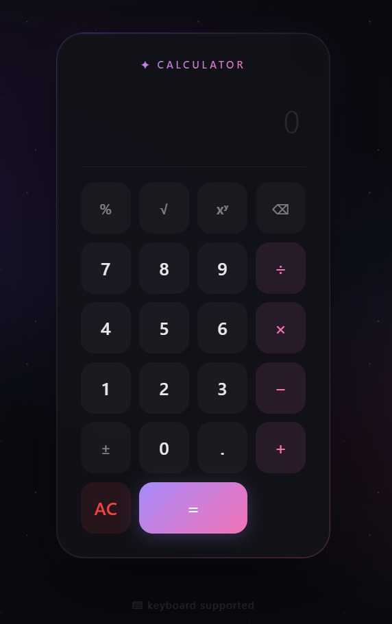

# 🧮 My Calculator

A sleek, modern calculator built with pure HTML, CSS, and JavaScript — no libraries or frameworks needed.



## ✨ Features

| Category | Features |
|----------|----------|
| **Basic** | Add, subtract, multiply, divide |
| **Smart** | Percentage (%), Square root (√), Power (xʸ), Sign toggle (±) |
| **Controls** | Backspace (⌫), Clear all (AC) |
| **Display** | Expression preview, cursor-aware input, auto-scroll |
| **Keyboard** | Full keyboard support — numbers, operators, Enter, Backspace, Escape |
| **UX** | Ripple click effect, smooth animations, responsive design |

## 🎨 Design

```
Background      Deep dark with animated star particles + purple/pink gradient orbs
Calculator card Frosted glass with backdrop-filter blur, gradient border glow, layered shadows
Accents         Purple-to-pink gradient for brand text and equal button
Interactions    Ripple on click, scale animation on press, hover lift
```

## 🔗 Live Demo

[Live Demo](https://nikhil-r2007.github.io/My-Calculator/)

## 🚀 How to Use

Just open `index.html` in any browser. That's it.

## 📁 Files

| File | Description |
|------|-------------|
| `index.html` | The full calculator app (HTML + CSS + JS all in one) |
| `README.md` | This file |

## ⌨️ Keyboard Shortcuts

| Key | Action |
|-----|--------|
| `0 – 9` | Enter numbers |
| `.` | Decimal point |
| `+` `-` `*` `/` | Operators |
| `%` | Percentage |
| `Enter` / `=` | Calculate |
| `Backspace` | Delete last character |
| `Escape` / `Delete` | Clear all |

---

## 📖 Code Breakdown

The entire app lives in a single `index.html` file (389 lines). Here is what each part does:

### HTML Structure

| Element | Purpose |
|---------|---------|
| `.bg` | Background layer with gradient orbs and animated star particles |
| `.calculator` | Main glassmorphism card wrapper |
| `.brand` | "✦ Calculator" heading with gradient text |
| `#display` | Read-only input showing current value (cursor-aware) |
| `#expression` | Shows previous expression (e.g., "5 + 3 =") below the display |
| `.buttons` | 4-column grid of all calculator buttons |
| `button.fn` | Function buttons — %, √, xʸ, ⌫, ± |
| `button.operator` | Operator buttons — ÷, ×, −, + (pink accent) |
| `button.equal` | Equal button with gradient background, spans 2 columns |
| `button.clear` | Clear (AC) button with red tint |

### CSS — Background (`<style>` lines 15-57)

```css
body { background: #0a0a0f; }
```
Sets a dark base. The `.bg` div creates **3 radial gradients** (purple, pink, blue) positioned at different corners for an ambient glow.

```css
.bg::before { ... }
```
Generates **star particles** using 10 `radial-gradient(1px 1px at X% Y%)` layers on a 200px grid with a `twinkle` animation that fades opacity between 0.5 and 1.

### CSS — Glassmorphism Card (`<style>` lines 59-86)

```css
.calculator {
  background: rgba(18, 18, 24, 0.85);
  backdrop-filter: blur(40px);
  border: 1px solid rgba(255, 255, 255, 0.06);
}
```
The frosted glass effect. `::before` creates a **gradient border** using `mask-composite: exclude` — the gradient is visible only on the border, not inside.

### CSS — Buttons (`<style>` lines 135-258)

```css
.buttons { display: grid; grid-template-columns: repeat(4, 1fr); gap: 10px; }
```
4-column grid. Each button has:
- `::after` — A radial gradient that follows the cursor (`--mx`, `--my` custom properties) creating a **hover glow**
- `:active` — Scales down to 0.94 for a **press effect**
- `.ripple` span — Created on mousedown, animates from scale(0) to scale(4) and fades out

```css
.equal {
  background: linear-gradient(135deg, #a78bfa, #f472b6);
  box-shadow: 0 4px 20px rgba(167, 139, 250, 0.25);
}
```
The = button uses the signature purple-to-pink gradient with a matching glow shadow.

### JavaScript — Ripple Effect (lines 307-319)

```javascript
btn.addEventListener("mousedown", function(e) {
  const ripple = document.createElement("span");
  ripple.className = "ripple";
  const size = Math.max(rect.width, rect.height);
  ripple.style.width = ripple.style.height = size + "px";
  ripple.style.left = (e.clientX - rect.left - size / 2) + "px";
  ripple.style.top = (e.clientY - rect.top - size / 2) + "px";
  this.appendChild(ripple);
  ripple.addEventListener("animationend", () => ripple.remove());
});
```
On every button mousedown, a circular `<span>` is created at the click position, animated via CSS, and removed after animation ends.

### JavaScript — Input Handling (lines 321-341)

```javascript
function press(value) {
  const cursor = display.selectionStart || display.value.length;
  display.value = display.value.slice(0, cursor) + value + display.value.slice(cursor);
  display.focus();
  display.setSelectionRange(cursor + value.length, cursor + value.length);
}
```
`press()` inserts a character **at the cursor position** (not just appending), making it feel like a real text input. `backspace()` removes the character before the cursor.

### JavaScript — Functions (lines 343-359)

| Function | What it does |
|----------|-------------|
| `pressFn('percent')` | Divides current value by 100 |
| `pressFn('sqrt')` | Applies `Math.sqrt()` |
| `pressFn('power')` | Appends `**` for JavaScript exponentiation |
| `pressFn('toggleSign')` | Adds or removes `-` prefix |

### JavaScript — Calculation (lines 361-375)

```javascript
function calculate() {
  const expression = display.value;
  try {
    const result = eval(expression);
    expressionEl.textContent = expression + " =";
    display.value = Number.isInteger(result) ? result.toString() : parseFloat(result.toFixed(10)).toString();
  } catch {
    display.value = "Error";
  }
}
```
Uses `eval()` to compute the expression. Shows the expression in the preview line and rounds floats to 10 decimal places to avoid precision artifacts.

### JavaScript — Keyboard Support (lines 377-386)

```javascript
document.addEventListener("keydown", (e) => {
  if (key >= "0" && key <= "9") { press(key); return; }
  if (["+", "-", "*", "/"].includes(key)) { press(key); return; }
  if (key === "Enter" || key === "=") { calculate(); return; }
  if (key === "Backspace") { backspace(); return; }
  if (key === "Escape" || key === "Delete") { clearAll(); return; }
});
```
Maps keyboard keys to calculator functions. Numbers and operators call `press()`, Enter calls `calculate()`, etc.

---

## 📝 Notes

- No installation required
- Works in Chrome, Firefox, Edge, Safari
- All code is in a single HTML file for easy sharing
